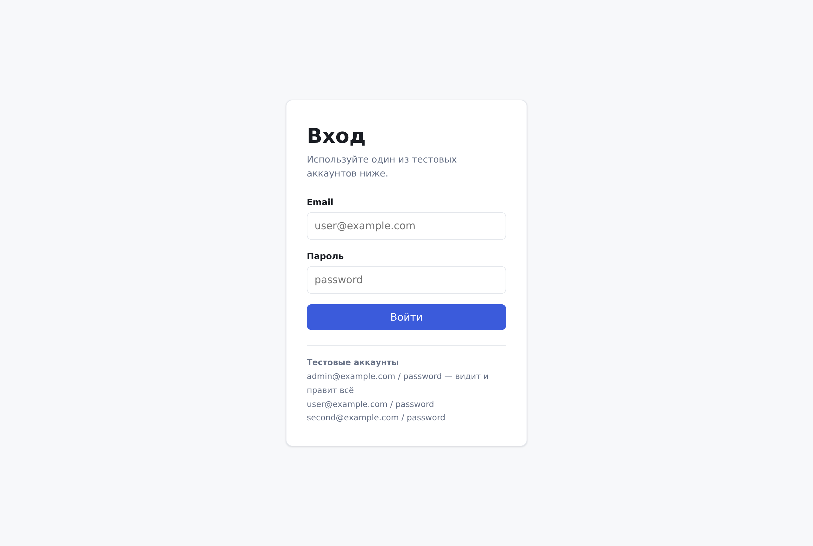
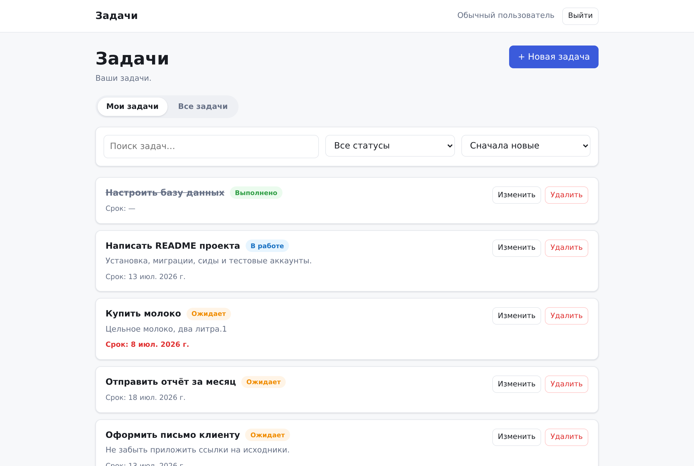
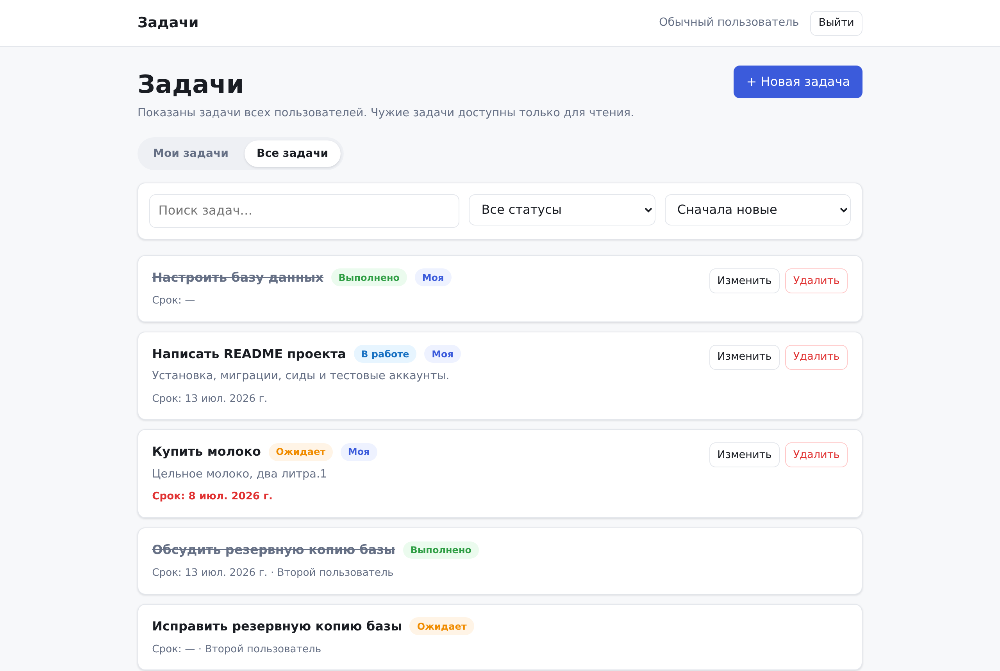
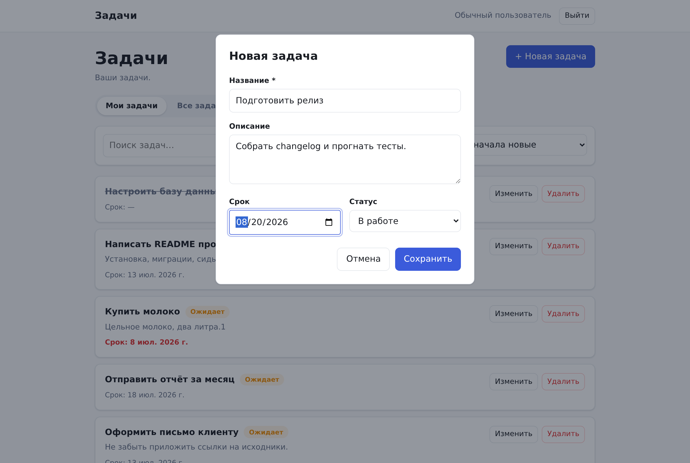
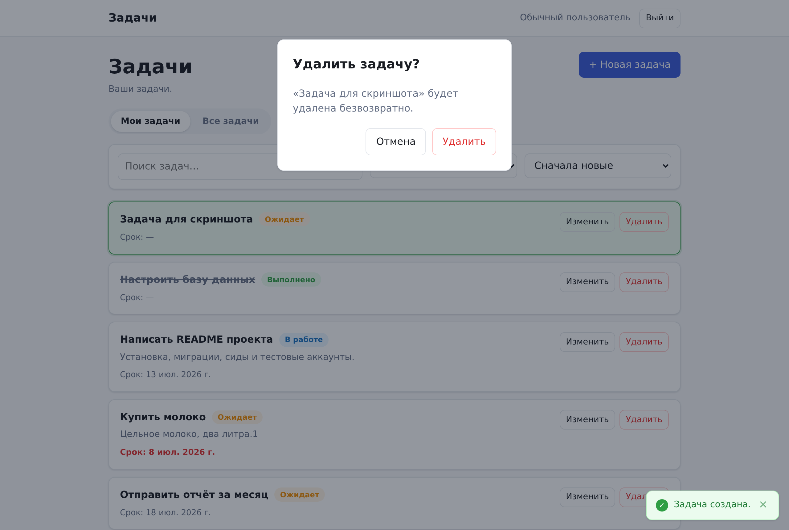
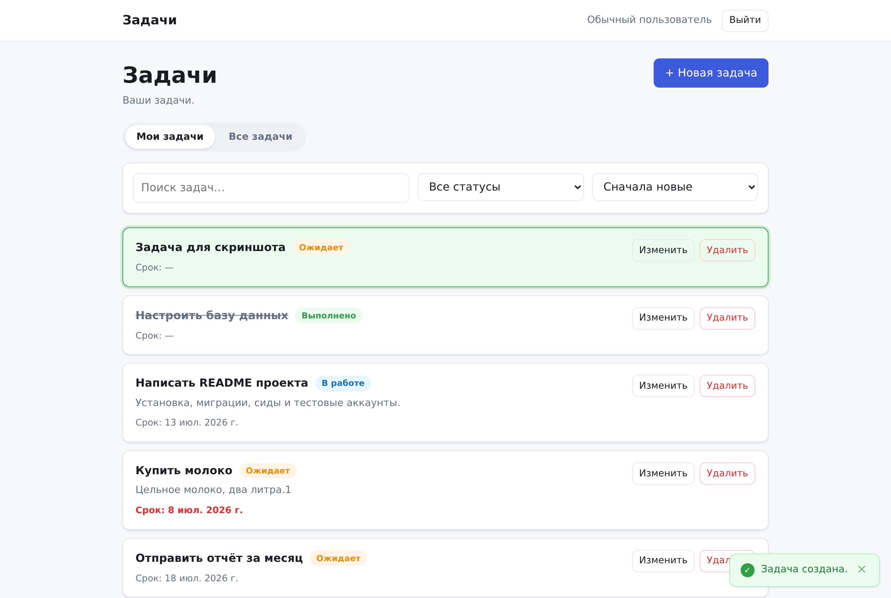
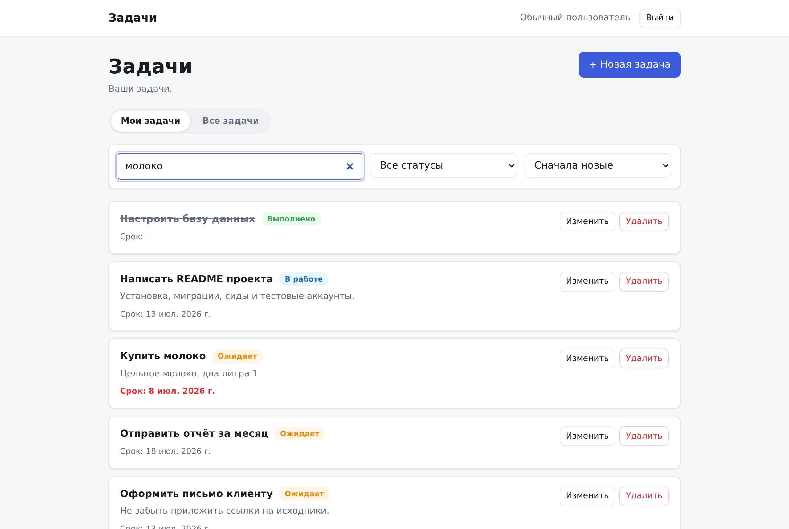
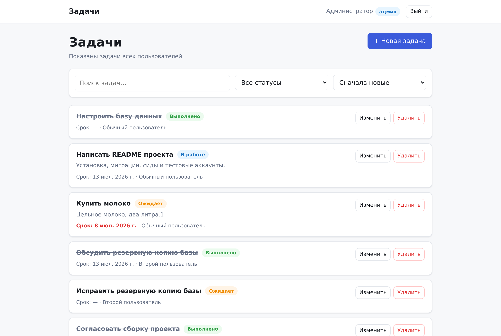
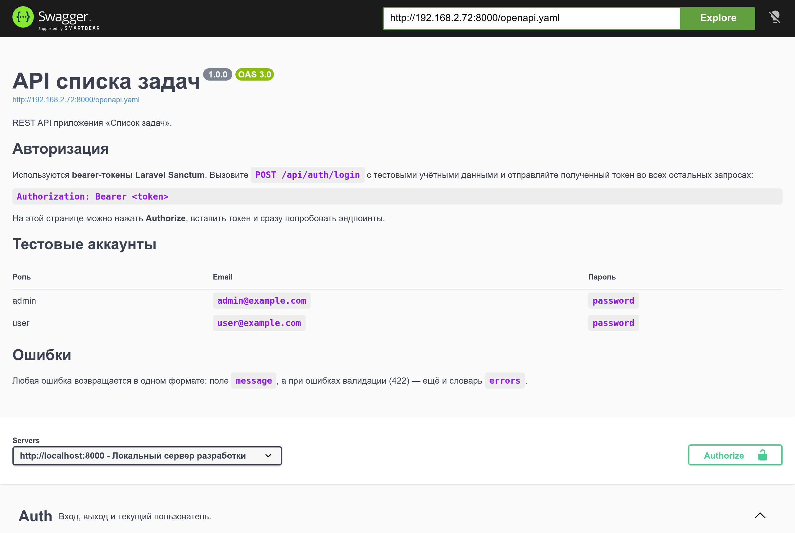

# Список задач — Laravel API + Nuxt SPA

Небольшой менеджер задач на классическом SPA/API-стеке.

- **Backend** — REST API на Laravel 12 (PHP 8.2+): Eloquent, миграции, сиды, валидация через Form Request, политики доступа, авторизация по токенам Sanctum, unit- и feature-тесты на PHPUnit, документация OpenAPI.
- **Frontend** — SPA на Nuxt 3 (Vue 3, Composition API): сторы Pinia, middleware маршрутов, плагин/composable для работы с API, клиентская валидация, тесты на Vitest.
- **База данных** — SQLite по умолчанию; MySQL и PostgreSQL подключаются через `.env`.

```
.
├── backend/            # API на Laravel 12
├── frontend/           # SPA на Nuxt 3
├── docker-compose.yml  # запуск одной командой
└── README.md
```

### Почему Laravel 12

Laravel 12 — последняя стабильная версия, которая поддерживает PHP 8.2, а именно на него ориентирован проект (`php -v` → 8.2). Laravel 13 требует PHP 8.3+, поэтому здесь корректный выбор — 12.

Nuxt зафиксирован на версии 3.20.2: приложение работает как SPA (`ssr: false`), а в 3.21 есть регрессия, из-за которой dev-сервер в этом режиме не запускается.

---

## Выбранный подход к авторизации — Bearer-токены Sanctum

Используется **Laravel Sanctum в режиме API-токенов**, а не cookie-сессия (SPA-режим).

**Почему:** приложение на Nuxt работает на другом origin (`:3000`), чем API (`:8000`). Для cookie-режима нужны same-site cookies, отдельный запрос за CSRF-токеном и согласованные настройки `stateful_domains` / `SESSION_DOMAIN` — всё это хрупко при разных origin и внутри Docker. Stateless bearer-токен не зависит от origin и естественно ложится на decoupled SPA.

**Как это работает:**

1. `POST /api/auth/login` проверяет учётные данные и возвращает токен, созданный через `createToken()`.
2. SPA сохраняет его в cookie `auth_token` (через `useCookie`), поэтому сессия переживает перезагрузку страницы.
3. Каждый запрос уходит с заголовком `Authorization: Bearer <token>` — см. `frontend/plugins/api.ts`.
4. Защищённые маршруты закрыты guard'ом `auth:sanctum`. Любой `401` очищает токен на клиенте и отправляет на `/login`.
5. `POST /api/auth/logout` отзывает **только** тот токен, которым сделан запрос, — на других устройствах вход сохраняется.

---

## Быстрый старт

### Вариант A — Docker

```bash
docker compose up --build
```

- Приложение → http://localhost:3000
- API → http://127.0.0.1:8000
- Документация API → http://127.0.0.1:8000/docs

Контейнер бэкенда сам создаёт `.env`, генерирует ключ приложения, накатывает миграции и сиды при старте.

### Вариант B — локальный запуск

**Backend**

```bash
cd backend
cp .env.example .env
composer install
php artisan key:generate

touch database/database.sqlite     # по умолчанию используется SQLite
php artisan migrate --seed

php artisan serve                  # http://127.0.0.1:8000
```

**Frontend** (во втором терминале)

```bash
cd frontend
cp .env.example .env               # NUXT_PUBLIC_API_BASE=http://127.0.0.1:8000/api
npm install
npm run dev                        # http://localhost:3000
```

Откройте http://localhost:3000 и войдите под одним из аккаунтов ниже.

> **О `127.0.0.1` вместо `localhost`.** `php artisan serve` слушает только IPv4. На некоторых Linux-системах браузер сначала резолвит `localhost` в `::1`, и тогда каждый запрос к API зависает. Указание `127.0.0.1` в адресе API решает проблему; там, где её нет, `http://localhost:8000/api` тоже работает.

> Нужен MySQL или PostgreSQL? Задайте `DB_CONNECTION` и значения `DB_*` в `backend/.env` и выполните `php artisan migrate --seed`. Миграции одинаково работают на всех трёх СУБД.

---

## Тестовые аккаунты (создаются сидом)

| Роль          | Email                | Пароль     | Что видит и может                                        |
| ------------- | -------------------- | ---------- | -------------------------------------------------------- |
| Администратор | `admin@example.com`  | `password` | **Все** задачи, редактирует и удаляет любую              |
| Пользователь  | `user@example.com`   | `password` | Свои задачи; через «Все задачи» — чужие, только для чтения |
| Пользователь  | `second@example.com` | `password` | То же самое, но со своим набором задач                   |

У всех трёх аккаунтов есть свои задачи, поэтому режим «Все задачи» и правила доступа видно сразу.

### Права на задачи

- **Редактировать и удалять** задачу может только её владелец. Администратор — исключение, он может всё.
- **Читать** задачи может любой авторизованный пользователь: по умолчанию список показывает только свои задачи, а переключатель «Все задачи» (`?scope=all`) показывает задачи всех.
- У чужих задач в списке кнопки «Изменить» и «Удалить» просто не отображаются, а сам API на такие запросы отвечает `403`. Свои задачи в общем списке помечены значком «Моя».

---

## Скриншоты

| Вход | Список задач |
| --- | --- |
|  |  |

**Все задачи глазами обычного пользователя.** Свои задачи помечены значком «Моя» и доступны для редактирования, у чужих кнопок «Изменить» и «Удалить» просто нет.



| Создание задачи | Подтверждение удаления |
| --- | --- |
|  |  |

**Уведомление об успехе и подсветка новой задачи.** Список обновляется на месте, строки не пропадают.



| Поиск | Взгляд администратора |
| --- | --- |
|  |  |

**Документация API — Swagger UI на `/docs`.**



---

## Документация API

Спецификация OpenAPI 3.0 лежит в `backend/public/openapi.yaml`, а Swagger UI отдаётся самим API:

- **http://127.0.0.1:8000/docs** — просмотреть эндпоинты, нажать **Authorize**, вставить токен из `POST /api/auth/login` и дёрнуть API прямо со страницы.

Swagger UI лежит рядом, в `backend/public/vendor/swagger-ui`, поэтому документация открывается и без интернета.

### Эндпоинты

Базовый URL — `/api`. Все ответы в JSON.

| Метод     | Эндпоинт       | Доступ           | Назначение                                 |
| --------- | -------------- | ---------------- | ------------------------------------------ |
| POST      | `/auth/login`  | публичный        | Авторизация, возвращает `{token, user}`    |
| POST      | `/auth/logout` | авторизованный   | Отзыв текущего токена                      |
| GET       | `/user`        | авторизованный   | Текущий пользователь                       |
| GET       | `/tasks`       | авторизованный   | Список: поиск, фильтр, сортировка, страницы |
| POST      | `/tasks`       | авторизованный   | Создание задачи                            |
| GET       | `/tasks/{id}`  | авторизованный   | Одна задача                                |
| PUT/PATCH | `/tasks/{id}`  | владелец / админ | Редактирование задачи                      |
| DELETE    | `/tasks/{id}`  | владелец / админ | Удаление задачи                            |

Параметры запроса `GET /tasks`:

| Параметр    | Значения                                          | По умолчанию |
| ----------- | ------------------------------------------------- | ------------ |
| `search`    | строка, ищется по названию и описанию             | —            |
| `status`    | `pending` \| `in_progress` \| `completed`         | —            |
| `scope`     | `mine` \| `all` — свои задачи или задачи всех     | `mine`       |
| `sort`      | `due_date` \| `status` \| `title` \| `created_at` | `created_at` |
| `direction` | `asc` \| `desc`                                   | `desc`       |
| `per_page`  | 1–100                                             | `10`         |
| `page`      | целое число                                       | `1`          |

Значение вне списка — это `422`, а не молча проигнорированный фильтр.

### Модель задачи

| Поле                      | Тип          | Примечание                                 |
| ------------------------- | ------------ | ------------------------------------------ |
| `id`                      | integer      | Первичный ключ                             |
| `user_id`                 | integer      | Владелец, берётся из авторизованного пользователя |
| `title`                   | string       | Обязательное, 3–255 символов               |
| `description`             | text \| null | Необязательное                             |
| `due_date`                | date \| null | Необязательное                             |
| `status`                  | enum         | `pending` \| `in_progress` \| `completed`  |
| `created_at`/`updated_at` | datetime     | Даты создания и изменения                  |

### Формат ошибок

У любой ошибки одна и та же форма — `message`, плюс `errors` при ошибках валидации:

```json
{ "message": "Поле название обязательно для заполнения.", "errors": { "title": ["Поле название обязательно для заполнения."] } }
```

| Код | Когда                                            |
| --- | ------------------------------------------------ |
| 401 | Токен отсутствует, недействителен или истёк      |
| 403 | Авторизован, но не владелец задачи и не админ    |
| 404 | Задача не найдена                                |
| 422 | Ошибка валидации (заполнено поле `errors`)       |
| 500 | Непредвиденная ошибка сервера                    |

Формат задан в одном месте: `backend/app/Exceptions/ApiExceptionHandler.php`.

Язык ответов задаётся через `APP_LOCALE` (по умолчанию `ru`, запасной — `en`). Тексты лежат в `backend/lang/{ru,en}/`.

### Пример

```bash
TOKEN=$(curl -s -X POST http://127.0.0.1:8000/api/auth/login \
  -H 'Content-Type: application/json' -H 'Accept: application/json' \
  -d '{"email":"user@example.com","password":"password"}' | jq -r .token)

curl -s "http://127.0.0.1:8000/api/tasks?status=pending&sort=due_date&direction=asc" \
  -H "Authorization: Bearer $TOKEN" -H 'Accept: application/json'
```

---

## Что реализовано

**Backend**

- Модель `Task` со скоупами для поиска, фильтра по статусу и сортировки по белому списку колонок (задачи без срока всегда в конце).
- Form Request'ы `IndexTaskRequest` / `StoreTaskRequest` / `UpdateTaskRequest`. Запрос на обновление рассчитан на PATCH: все поля необязательны, но проверяются, если переданы.
- `TaskPolicy` разрешает изменение и удаление только владельцу; админ может всё. Чтение открыто любому авторизованному пользователю. Владелец задачи всегда берётся из авторизованного пользователя, а не из тела запроса.
- Параметр `?scope=all` в списке задач переключает выборку со «своих» на «все».
- API Resources (`TaskResource`, `UserResource`) формируют ответ.
- Колонка `role` (`user` / `admin`) управляет и выборкой списка, и правами.
- Единый обработчик исключений на весь JSON-контракт ошибок.

**Frontend**

- Страница входа с обработкой ошибок; middleware `auth` / `guest`; любой `401` очищает сессию и ведёт на `/login`.
- Список задач с сортировкой (срок, статус, название, дата), фильтром по статусу и **поиском с debounce, синхронизированным с query-параметрами URL** — ссылку на отфильтрованный список можно отправить, сохранить в закладки, она переживает перезагрузку.
- Создание и редактирование в модальном окне, удаление через подтверждение — без перезагрузок страницы.
- После создания, изменения или удаления список обновляется на месте: строки не исчезают, показывается индикатор «Обновление…», а сверху всплывает уведомление об успехе. Только что созданная задача коротко подсвечивается.
- Состояния загрузки, ошибки API (с кнопкой «Повторить») и пустого списка — не путаются между собой.
- Клиентская валидация повторяет правила бэкенда; ошибки `422` с сервера раскладываются обратно по полям формы.
- Переключатель «Мои задачи» / «Все задачи» для обычного пользователя, тоже синхронизированный с URL. Кнопки «Изменить» и «Удалить» скрыты у чужих задач, свои помечены значком «Моя».
- Пагинация с обеих сторон.

---

## Рендеринг и производительность

Приложение работает как **SPA** (`ssr: false` в `nuxt.config.ts`). Это осознанный выбор, а не значение по умолчанию.

**Почему SPA здесь уместен.** Авторизация построена на bearer-токене Sanctum, который живёт в cookie браузера. Каждая страница за `auth`-middleware — это персональные данные конкретного пользователя: их нельзя ни закешировать на CDN, ни отдать анонимному посетителю. Публичного контента, который выигрывал бы от SSR или SSG (SEO, Open Graph, быстрый первый рендер для гостей), в приложении нет — единственная открытая страница `/login` не индексируется. SSR в такой ситуации добавил бы сервер Node рядом с PHP-бэкендом и удвоил сетевой путь до API (браузер → Node → Laravel), не дав ничего взамен.

**Как включить SSR или SSG, если он понадобится.** Достаточно переключить флаг:

```ts
// nuxt.config.ts
export default defineNuxtConfig({
  ssr: true,                       // или nuxt generate для статики
})
```

Но одного флага мало — придётся переделать слой авторизации, потому что при SSR запросы к API уходят с сервера, где нет ни `document.cookie`, ни браузерного заголовка `Authorization`:

- `useCookie('auth_token')` на сервере читает cookie из входящего запроса — это работает, но токен нужно **явно прокидывать** в серверные вызовы API. Сейчас заголовок навешивает интерцептор в `plugins/api.ts`; при SSR его нужно дополнить чтением cookie из `useRequestHeaders(['cookie'])`.
- Запросы данных надо перевести с «дёрнуть в `onMounted`» на `useAsyncData` / `useFetch`, иначе список задач всё равно отрисуется только на клиенте.
- Токен в cookie должен стать `httpOnly` (сейчас он доступен JS, потому что его читает клиентский `$fetch`). А `httpOnly` уже сильно ближе к cookie-режиму Sanctum со всеми его CSRF-требованиями — то есть решение про SSR тянет за собой пересмотр всего auth-подхода.
- Нужно исключить утечку токена в SSR-пейлоад: `useState` и результаты `useAsyncData` сериализуются в HTML.

Коротко: SSR тут технически возможен, но выигрыша не даёт, а цену за него платить пришлось бы сразу и в авторизации, и в безопасности.

### Разделение бандла (code splitting)

- Nuxt по умолчанию делит бандл **по маршрутам**: `/login` и список задач приезжают разными чанками.
- Тяжёлые модальные окна подключены лениво — через префикс `Lazy` (под капотом Nuxt оборачивает их в `defineAsyncComponent`):

  ```vue
  <LazyTaskFormModal v-if="showModal" ... />
  <LazyConfirmDialog v-if="deleting" ... />
  ```

  Их JS и CSS выносятся в отдельные чанки и скачиваются только при первом открытии диалога. В сборке это `TaskFormModal.*`, `ConfirmDialog.*` и общий для них `AppModal.*`; чанк страницы обращается к ним через динамический `import()`.

- Список задач переиспользует уже загруженные данные и обновляется «тихо» после create/update/delete — без повторного полного рендера и без мигания скелетона.

---

## Доступность (a11y)

- **Семантическая разметка**: `header` / `main` / `nav` / `search` / `article`, список задач — это `ul` > `li`, заголовок задачи — `h2`.
- **Ссылка «Перейти к содержимому»** появляется при первом Tab и уводит фокус на `main`.
- **Модальные окна** (`components/AppModal.vue`): `role="dialog"`, `aria-modal="true"`, `aria-labelledby` указывает на реальный заголовок; окно телепортируется в конец `body`.
  - фокус уезжает на первое поле при открытии и **возвращается на кнопку, которая окно открыла**, при закрытии;
  - **Tab и Shift+Tab заперты внутри окна** (фокус-трап);
  - **Esc закрывает** окно, фон не скроллится, пока оно открыто.
- **Формы**: у каждого поля настоящий `<label>` (визуально скрытый там, где мешает — класс `.sr-only`), ошибки связаны через `aria-describedby` и `aria-invalid`.
- **Кнопки действий** в строках задач подписаны через `aria-label` («Изменить задачу «Купить молоко»»), потому что видимый текст одинаков во всех строках. Декоративные спиннеры помечены `aria-hidden`.
- **Динамика озвучивается**: уведомления — `role="status"` в `aria-live`-регионе, ошибки — `role="alert"`, список получает `aria-busy` во время фонового обновления, переключатель «Мои / Все задачи» — `aria-pressed`.
- **Клавиатура**: видимое кольцо фокуса через `:focus-visible`, никаких ловушек фокуса вне диалогов.

---

## Тесты

**Backend** — PHPUnit. Unit-тесты покрывают политику доступа и enum статусов; feature-тесты — авторизацию, CRUD, права владельца и админа, валидацию, контракт ошибок, поиск, фильтрацию, сортировку и пагинацию.

```bash
cd backend
php artisan test
```

**Frontend** — Vitest в окружении Nuxt.

```bash
cd frontend
npm run test        # unit-тесты + тесты компонентов и сторов
npm run typecheck   # vue-tsc
```

Фронтовые тесты покрывают критичные сценарии: стор авторизации (успех, неверные данные, запасное сообщение об ошибке), стор задач (загрузка, пустой список, ошибка, тихое обновление, обновление на месте, удаление), уведомления, правила скрытия кнопок «Изменить»/«Удалить» и хелперы валидации формы. Отдельный набор тестов проверяет доступность модального окна: `aria-modal`, связь `aria-labelledby` с заголовком, фокус-трап по Tab и Shift+Tab, закрытие по Esc и возврат фокуса на кнопку, которая окно открыла.

---

## Заметки

- Slim-скелет Laravel 12: middleware и обработка исключений настраиваются в `bootstrap/app.php`.
- Origin'ы для CORS задаются переменной `CORS_ALLOWED_ORIGINS`; время жизни токена Sanctum — `SANCTUM_TOKEN_EXPIRATION` (пусто = бессрочно).
- SQLite выбран, чтобы проект запускался без установки СУБД.
- `php artisan serve` поднимает однопоточный dev-сервер PHP. Если запросы начнут подвисать, помогает `php artisan serve --no-reload` вместе с `PHP_CLI_SERVER_WORKERS=4`.
