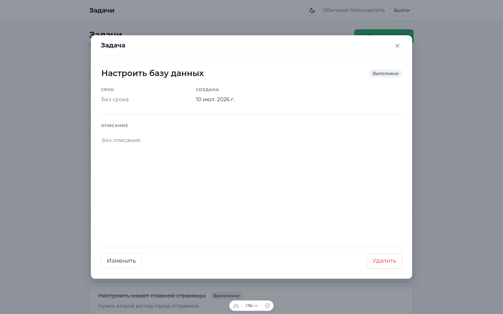
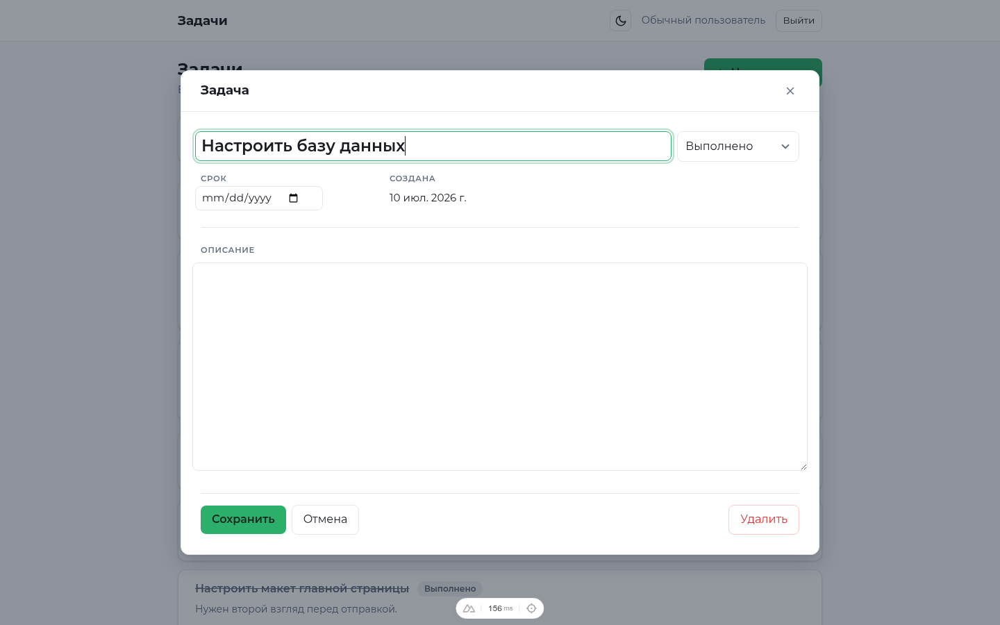
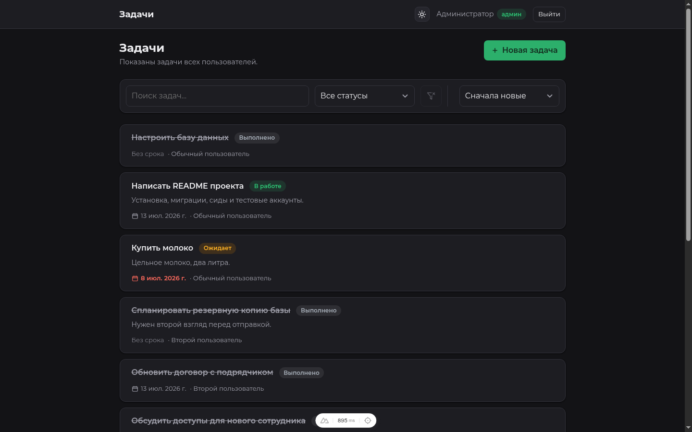
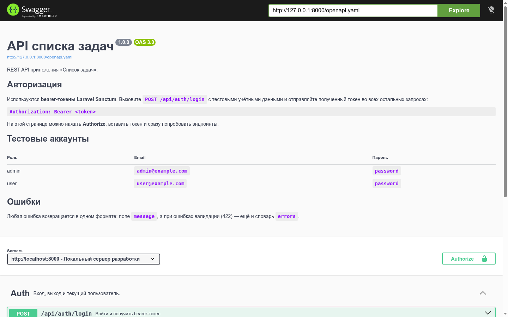

# Список задач — Laravel API + Nuxt SPA

Небольшой менеджер задач на классическом SPA/API-стеке.

> [!IMPORTANT]
> **Рецензенту:** ключевые инженерные решения, трактовка неоднозначностей ТЗ и trade-offs вынесены в отдельный файл → [DECISIONS.md](./DECISIONS.md). Там же — что сознательно оставлено за рамками ТЗ и почему.

- **Backend** — REST API на Laravel 12 (PHP 8.2+): Eloquent, миграции, сиды, валидация через Form Request, политики доступа, авторизация по токенам Sanctum, unit- и feature-тесты на PHPUnit, документация OpenAPI.
- **Frontend** — SPA на Nuxt 3 (Vue 3, Composition API): сторы Pinia, middleware маршрутов, плагин/composable для работы с API, клиентская валидация, тесты на Vitest.
- **База данных** — SQLite по умолчанию; MySQL и PostgreSQL подключаются через `.env`.

```
.
├── backend/            # API на Laravel 12
├── frontend/           # SPA на Nuxt 3
├── docker-compose.yml  # запуск одной командой
└── README.md
```

## Авторизация — Bearer-токены Sanctum

Используется **Laravel Sanctum в режиме API-токенов**, а не cookie-сессия (SPA-режим). Почему именно токены — в [DECISIONS.md](./DECISIONS.md#2-аутентификация-sanctum-bearer-токены-а-не-cookie-сессия).

**Как это работает:**

1. `POST /api/auth/login` проверяет учётные данные и возвращает токен, созданный через `createToken()`.
2. SPA сохраняет его в cookie `auth_token` (через `useCookie`), поэтому сессия переживает перезагрузку страницы.
3. Каждый запрос уходит с заголовком `Authorization: Bearer <token>` — см. `frontend/plugins/api.ts`.
4. Защищённые маршруты закрыты guard'ом `auth:sanctum`. Любой `401` очищает токен на клиенте и отправляет на `/login`.
5. `POST /api/auth/logout` отзывает **только** тот токен, которым сделан запрос, — на других устройствах вход сохраняется.

---

## Быстрый старт

### Вариант A — Docker

```bash
docker compose up --build
```

- Приложение → http://localhost:3000
- API → http://127.0.0.1:8000
- Документация API → http://127.0.0.1:8000/docs

Контейнер бэкенда сам создаёт `.env`, генерирует ключ приложения, накатывает миграции и сиды при старте.

### Вариант B — локальный запуск

**Backend**

```bash
cd backend
cp .env.example .env
composer install
php artisan key:generate

touch database/database.sqlite     # по умолчанию используется SQLite
php artisan migrate --seed

php artisan serve                  # http://127.0.0.1:8000
```

**Frontend** (во втором терминале)

```bash
cd frontend
cp .env.example .env               # NUXT_PUBLIC_API_BASE=http://127.0.0.1:8000/api
npm install
npm run dev                        # http://localhost:3000
```

Откройте http://localhost:3000 и войдите под одним из аккаунтов ниже.

> **О `127.0.0.1` вместо `localhost`.** `php artisan serve` слушает только IPv4. На некоторых Linux-системах браузер сначала резолвит `localhost` в `::1`, и тогда каждый запрос к API зависает. Указание `127.0.0.1` в адресе API решает проблему; там, где её нет, `http://localhost:8000/api` тоже работает.

> Нужен MySQL или PostgreSQL? Задайте `DB_CONNECTION` и значения `DB_*` в `backend/.env` и выполните `php artisan migrate --seed`. Миграции одинаково работают на всех трёх СУБД.

---

## Тестовые аккаунты (создаются сидом)

| Роль          | Email                | Пароль     | Что видит и может                           |
| ------------- | -------------------- | ---------- | ------------------------------------------- |
| Администратор | `admin@example.com`  | `password` | **Все** задачи, редактирует и удаляет любую |
| Пользователь  | `user@example.com`   | `password` | Только свои задачи                          |
| Пользователь  | `second@example.com` | `password` | То же самое, но со своим набором задач      |

У всех трёх аккаунтов есть свои задачи, поэтому разграничение ролей видно сразу.

### Права на задачи

- **Список задач** ограничен ролью: обычный пользователь видит только свои задачи, администратор — задачи всех пользователей.
- **Одну задачу по id** (`GET /api/tasks/{id}`) может прочитать любой авторизованный пользователь — так спецификация помечает этот эндпоинт («auth»), и так работают ссылки на страницы задач.
- **Редактировать и удалять** задачу может только её владелец. Администратор — исключение, он может всё. У чужих задач кнопки «Изменить» и «Удалить» не отображаются, а сам API на такие запросы отвечает `403`.

---

## Скриншоты

| Вход | Список задач |
| --- | --- |
|  |  |

**Карточка задачи.** Открывается поверх списка (URL меняется на `/tasks/{id}`), в режиме чтения — просто текст: можно выделять и копировать.



**Редактирование.** «Изменить» превращает всю карточку в форму — название, статус, срок и описание правятся вместе; «Сохранить» / «Отмена» внизу.



| Уведомление после сохранения | Подтверждение удаления |
| --- | --- |
|  |  |

| Поиск и фильтры (со сбросом) | Взгляд администратора |
| --- | --- |
|  |  |

**Тёмная тема.** Переключается в шапке, выбор запоминается.



**Документация API — Swagger UI на `/docs`.**



---

## Документация API

Спецификация OpenAPI 3.0 лежит в `backend/public/openapi.yaml`, а Swagger UI отдаётся самим API:

- **http://127.0.0.1:8000/docs** — просмотреть эндпоинты, нажать **Authorize**, вставить токен из `POST /api/auth/login` и дёрнуть API прямо со страницы.

Swagger UI лежит рядом, в `backend/public/vendor/swagger-ui`, поэтому документация открывается и без интернета.

### Эндпоинты

Базовый URL — `/api`. Все ответы в JSON.

| Метод     | Эндпоинт       | Доступ           | Назначение                                 |
| --------- | -------------- | ---------------- | ------------------------------------------ |
| POST      | `/auth/login`  | публичный        | Авторизация, возвращает `{token, user}`    |
| POST      | `/auth/logout` | авторизованный   | Отзыв текущего токена                      |
| GET       | `/user`        | авторизованный   | Текущий пользователь                       |
| GET       | `/tasks`       | авторизованный   | Список: поиск, фильтр, сортировка, страницы |
| POST      | `/tasks`       | авторизованный   | Создание задачи                            |
| GET       | `/tasks/{id}`  | авторизованный   | Одна задача                                |
| PUT/PATCH | `/tasks/{id}`  | владелец / админ | Редактирование задачи                      |
| DELETE    | `/tasks/{id}`  | владелец / админ | Удаление задачи                            |

Параметры запроса `GET /tasks`:

| Параметр    | Значения                                          | По умолчанию |
| ----------- | ------------------------------------------------- | ------------ |
| `search`    | строка, ищется по названию и описанию             | —            |
| `status`    | `pending` \| `in_progress` \| `completed`         | —            |
| `sort`      | `due_date` \| `status` \| `title` \| `created_at` | `created_at` |
| `direction` | `asc` \| `desc`                                   | `desc`       |
| `per_page`  | 1–100                                             | `10`         |
| `page`      | целое число                                       | `1`          |

Значение вне списка — это `422`, а не молча проигнорированный фильтр.

### Модель задачи

| Поле                      | Тип          | Примечание                                 |
| ------------------------- | ------------ | ------------------------------------------ |
| `id`                      | integer      | Первичный ключ                             |
| `user_id`                 | integer      | Владелец, берётся из авторизованного пользователя |
| `title`                   | string       | Обязательное, 3–255 символов               |
| `description`             | text \| null | Необязательное                             |
| `due_date`                | date \| null | Необязательное                             |
| `status`                  | enum         | `pending` \| `in_progress` \| `completed`  |
| `created_at`/`updated_at` | datetime     | Даты создания и изменения                  |

### Формат ошибок

У любой ошибки одна и та же форма — `message`, плюс `errors` при ошибках валидации:

```json
{ "message": "Поле название обязательно для заполнения.", "errors": { "title": ["Поле название обязательно для заполнения."] } }
```

| Код | Когда                                            |
| --- | ------------------------------------------------ |
| 401 | Токен отсутствует, недействителен или истёк      |
| 403 | Авторизован, но не владелец задачи и не админ    |
| 404 | Задача не найдена                                |
| 422 | Ошибка валидации (заполнено поле `errors`)       |
| 500 | Непредвиденная ошибка сервера                    |

Формат задан в одном месте: `backend/app/Exceptions/ApiExceptionHandler.php`.

Язык ответов задаётся через `APP_LOCALE` (по умолчанию `ru`, запасной — `en`). Тексты лежат в `backend/lang/{ru,en}/`.

### Пример

```bash
TOKEN=$(curl -s -X POST http://127.0.0.1:8000/api/auth/login \
  -H 'Content-Type: application/json' -H 'Accept: application/json' \
  -d '{"email":"user@example.com","password":"password"}' | jq -r .token)

curl -s "http://127.0.0.1:8000/api/tasks?status=pending&sort=due_date&direction=asc" \
  -H "Authorization: Bearer $TOKEN" -H 'Accept: application/json'
```

---

## Что реализовано

**Backend**

- Модель `Task` со скоупами для поиска, фильтра по статусу и сортировки по белому списку колонок (задачи без срока всегда в конце).
- Form Request'ы `IndexTaskRequest` / `StoreTaskRequest` / `UpdateTaskRequest`. Запрос на обновление рассчитан на PATCH: все поля необязательны, но проверяются, если переданы.
- `TaskPolicy` разрешает изменение и удаление только владельцу; админ может всё. Чтение одной задачи по id открыто любому авторизованному пользователю (в спецификации эндпоинт помечен «auth»). Владелец задачи всегда берётся из авторизованного пользователя, а не из тела запроса.
- Список задач ограничен ролью: пользователь получает только свои задачи, админ — все.
- Вход защищён rate limiting'ом: не более 6 попыток в минуту на пару email+IP, дальше `429`.
- Токены Sanctum живут 7 дней (`SANCTUM_TOKEN_EXPIRATION`, в минутах); просроченные ежедневно вычищаются командой `sanctum:prune-expired` по расписанию.
- API Resources (`TaskResource`, `UserResource`) формируют ответ; email владельца задачи наружу не отдаётся.
- Колонка `role` (`user` / `admin`) управляет и выборкой списка, и правами.
- Единый обработчик исключений на весь JSON-контракт ошибок.

**Frontend**

- Страница входа с обработкой ошибок; middleware `auth` / `guest`; любой `401` очищает сессию и ведёт на `/login`.
- Список задач с сортировкой (срок, статус, название, дата), фильтром по статусу и **поиском с debounce, синхронизированным с query-параметрами URL** — ссылку на отфильтрованный список можно отправить, сохранить в закладки, она переживает перезагрузку.
- Работа с задачей — в её карточке, как в Jira: список только для чтения, клик открывает задачу; «Изменить» превращает поля карточки в форму на месте (Esc — отмена), создание — та же пустая карточка на `/tasks/new`, после сохранения адрес меняется на настоящий `/tasks/{id}`. Удаление — из карточки, с подтверждением.
- После изменений список обновляется на месте: строки не исчезают, показывается индикатор «Обновление…», а сверху всплывает уведомление об успехе.
- Состояния загрузки, ошибки API (с кнопкой «Повторить») и пустого списка — не путаются между собой.
- Клиентская валидация повторяет правила бэкенда; ошибки `422` с сервера раскладываются обратно по полям формы.
- **Страницы задач с постоянными ссылками**: клик по задаче открывает её поверх списка (URL меняется на `/tasks/{id}`, кнопка «Назад» возвращает к списку без перезагрузки и повторного запроса), а открытая напрямую ссылка `/tasks/{id}` рендерит полноценную страницу задачи — её можно отправить коллеге или сохранить в закладки.
- Кнопки «Изменить» и «Удалить» скрыты у чужих задач; в списке администратора свои задачи помечены значком «Моя».
- Светлая и тёмная темы: переключатель в шапке, выбор хранится в cookie, по умолчанию берётся системная `prefers-color-scheme`. Акцентный цвет — фирменный зелёный.
- Пагинация с обеих сторон.

---

## Рендеринг и производительность

Приложение работает как **SPA** (`ssr: false` в `nuxt.config.ts`) — осознанный выбор, а не значение по умолчанию: весь контент персональный и живёт за авторизацией, публичных страниц под SEO нет. Полное обоснование и что потребовалось бы для включения SSR — в [DECISIONS.md](./DECISIONS.md#4-spa-а-не-ssr).

### Разделение бандла (code splitting)

- Nuxt по умолчанию делит бандл **по маршрутам**: `/login` и список задач приезжают разными чанками.
- Диалог подтверждения удаления подключён лениво — через префикс `Lazy` (под капотом Nuxt оборачивает его в `defineAsyncComponent`):

  ```vue
  <LazyConfirmDialog v-if="deleting" ... />
  ```

  Его JS и CSS выносятся в отдельный чанк и скачиваются только при первом открытии; чанк страницы обращается к нему через динамический `import()`.

- Список задач переиспользует уже загруженные данные и обновляется «тихо» после create/update/delete — без повторного полного рендера и без мигания скелетона.

---

## Доступность (a11y)

- **Семантическая разметка**: `header` / `main` / `nav` / `role="search"` / `article`, список задач — это `ul` > `li`, заголовок задачи — `h2`.
- **Ссылка «Перейти к содержимому»** появляется при первом Tab и уводит фокус на `main`.
- **Модальные окна** (`components/AppModal.vue`): `role="dialog"`, `aria-modal="true"`, `aria-labelledby` указывает на реальный заголовок; окно телепортируется в конец `body`.
  - фокус уезжает на первое поле при открытии и **возвращается на кнопку, которая окно открыла**, при закрытии;
  - **Tab и Shift+Tab заперты внутри окна** (фокус-трап);
  - **Esc закрывает** окно, фон не скроллится, пока оно открыто.
- **Формы**: у каждого поля настоящий `<label>` (визуально скрытый там, где мешает — класс `.sr-only`), ошибки связаны через `aria-describedby` и `aria-invalid`.
- **Кнопки действий** в строках задач подписаны через `aria-label` («Изменить задачу «Купить молоко»»), потому что видимый текст одинаков во всех строках. Декоративные спиннеры помечены `aria-hidden`.
- **Динамика озвучивается**: уведомления — `role="status"` в `aria-live`-регионе, ошибки — `role="alert"`, список получает `aria-busy` во время фонового обновления, переключатель «Мои / Все задачи» — `aria-pressed`.
- **Клавиатура**: видимое кольцо фокуса через `:focus-visible`, никаких ловушек фокуса вне диалогов.

---

## Тесты

**Backend** — PHPUnit. Unit-тесты покрывают политику доступа и enum статусов; feature-тесты — авторизацию, CRUD, права владельца и админа, валидацию, контракт ошибок, поиск, фильтрацию, сортировку и пагинацию.

```bash
cd backend
php artisan test
```

**Frontend** — Vitest в окружении Nuxt.

```bash
cd frontend
npm run test        # unit-тесты + тесты компонентов и сторов
npm run typecheck   # vue-tsc
```

Фронтовые тесты покрывают критичные сценарии: стор авторизации (успех, неверные данные, запасное сообщение об ошибке), стор задач (загрузка, пустой список, ошибка, тихое обновление, обновление на месте, удаление), уведомления, правила скрытия кнопок «Изменить»/«Удалить» и хелперы валидации формы. Отдельный набор тестов проверяет доступность модального окна: `aria-modal`, связь `aria-labelledby` с заголовком, фокус-трап по Tab и Shift+Tab, закрытие по Esc и возврат фокуса на кнопку, которая окно открыла.

---

## Заметки

- Laravel 12 выбран как последняя стабильная ветка с поддержкой PHP 8.2 (нижняя граница из ТЗ); подробнее — в [DECISIONS.md](./DECISIONS.md#3-laravel-12-а-не-13).
- Nuxt зафиксирован на версии 3.20.2: приложение работает как SPA (`ssr: false`), а в 3.21 есть регрессия, из-за которой dev-сервер в этом режиме не запускается.
- Slim-скелет Laravel 12: middleware и обработка исключений настраиваются в `bootstrap/app.php`.
- Origin'ы для CORS задаются переменной `CORS_ALLOWED_ORIGINS`; время жизни токена Sanctum — `SANCTUM_TOKEN_EXPIRATION` (пусто = бессрочно).
- SQLite выбран, чтобы проект запускался без установки СУБД.
- `php artisan serve` поднимает однопоточный dev-сервер PHP. Если запросы начнут подвисать, помогает `php artisan serve --no-reload` вместе с `PHP_CLI_SERVER_WORKERS=4`.
